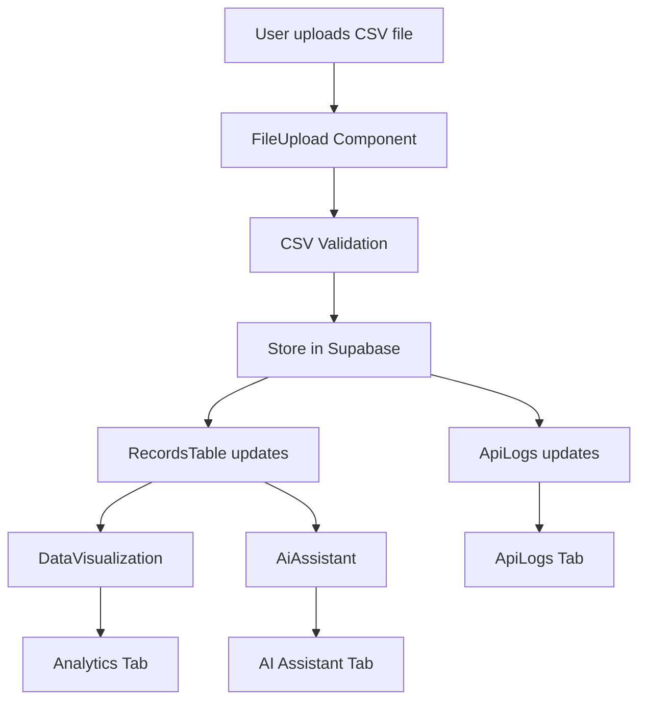
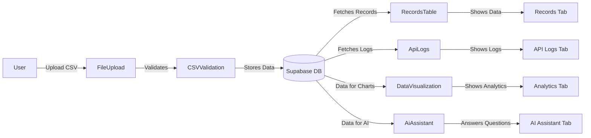
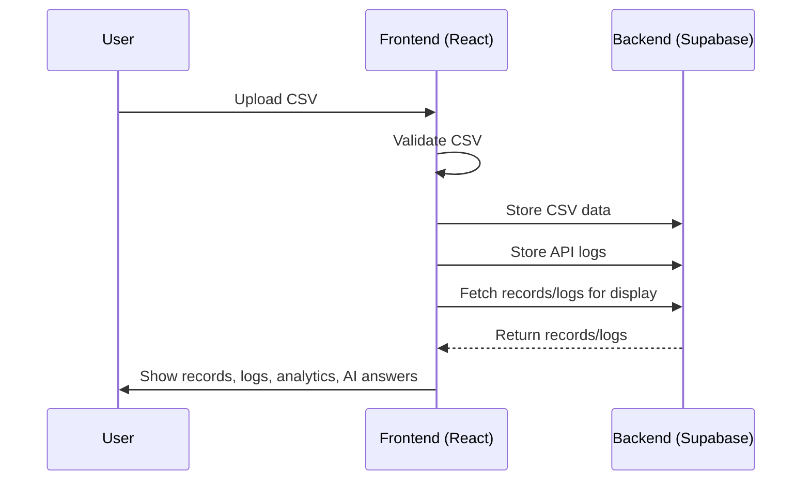

# Record Insight API

A modern, full-stack dashboard for uploading, validating, and analyzing CSV datasets with real-time API logging, analytics, and AI-powered insights.

[](YOUR_LIVE_LINK_HERE)

---

## 🚀 Features
- **CSV Upload & Validation**: Drag-and-drop CSV upload with instant validation and feedback.
- **Data Records Table**: View, search, and manage uploaded records.
- **API Logs**: Real-time API request/response logs, auto-cleared per session/upload.
- **Analytics**: Visualize your data with interactive charts.
- **AI Assistant**: Ask questions about your data using natural language.
- **Supabase Integration**: Secure, scalable backend for data and logs.
- **Modern UI**: Built with React, TailwindCSS, and best UX practices.

---

## 🗺️ Application Flow

### Main Flowchart


### Architecture Diagram


### Sequence Diagram


---

## 🛠️ Getting Started

### 1. Clone the repository
```bash
git clone https://github.com/YOUR_USERNAME/record-insight-api.git
cd record-insight-api
```

### 2. Install dependencies
```bash
npm install
```

### 3. Configure Supabase
- Create a [Supabase](https://supabase.com/) project.
- Copy your Supabase credentials to `src/integrations/supabase/client.ts`.
- Run any migrations in `supabase/migrations/` if needed.

### 4. Start the development server
```bash
npm run dev
```

### 5. Open in your browser
Visit [http://localhost:8080](http://localhost:8080)

---

## 📖 Usage Guide
- **Upload Tab**: Drag and drop your CSV files to upload and validate.
- **Records Tab**: View and search your uploaded data. Blank until a file is uploaded.
- **Analytics Tab**: Visualize your data with charts.
- **AI Assistant Tab**: Ask questions about your data in plain English.
- **API Logs Tab**: Monitor API requests and responses. Logs are cleared on refresh or new upload.

---

## 🧩 Technologies Used
- **Frontend**: React, TypeScript, TailwindCSS, Vite
- **Backend**: Supabase (Postgres, Auth, Storage)
- **Visualization**: Chart.js
- **AI**: OpenAI API (optional, for AI Assistant)

---

## 🤝 Contributing
1. Fork this repo
2. Create your feature branch (`git checkout -b feature/YourFeature`)
3. Commit your changes (`git commit -am 'Add new feature'`)
4. Push to the branch (`git push origin feature/YourFeature`)
5. Open a Pull Request

---

## 📄 License
This project is licensed under the MIT License.

---

